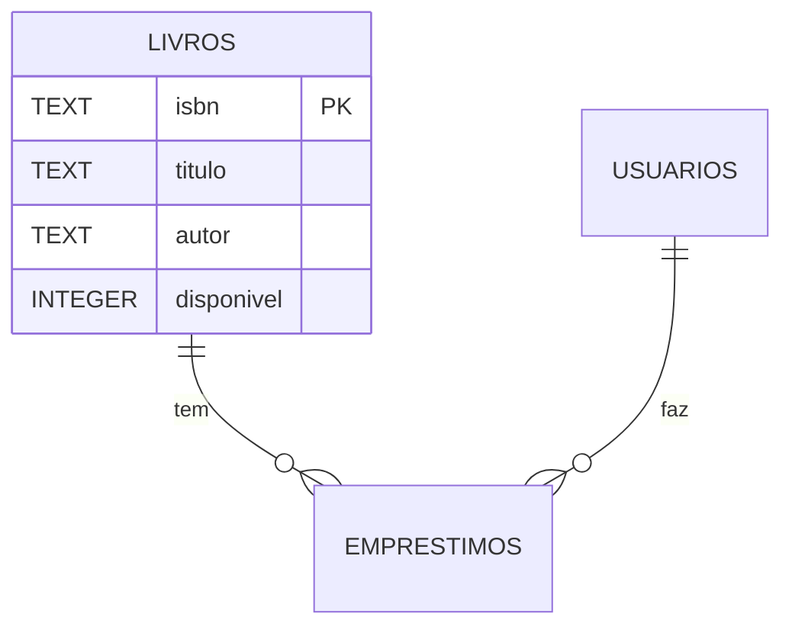

A Biblioteca de Sharlayan é uma das maiores instituições de conhecimento
de Eorzea. Os Sábios catalogam tomos, registram empréstimos para
aventureiros, controlam quem pegou o quê e quando. **Esse Trial pede que
você modele esse sistema em Python**: classes para Livro, Usuário e
Biblioteca, com métodos pra pegar emprestado, devolver, listar. Persistência
em SQLite. Primeira vez que vale a pena de verdade usar Programação
Orientada a Objetos.

:::caution[Pré-requisito]
Esse Trial assume que você completou o **Tomo II (Savage)**, especificamente
os capítulos de Classes e objetos, Herança, e SQLite. Se ainda não fez,
volta e faz primeiro. Não é pré-requisito por capricho: você não vai
conseguir terminar sem.
:::

## Briefing

Sistema de biblioteca com:

- Cadastro de livros (título, autor, ISBN, disponível ou não)
- Cadastro de usuários (nome, id, livros emprestados)
- Empréstimo (vincula livro a usuário, marca livro como indisponível)
- Devolução (libera o livro)
- Listagem de livros disponíveis e dos emprestados
- Histórico de empréstimos (quem pegou o quê e quando)
- Persistência em SQLite

**Tempo estimado**: 4-6 horas.

## Loadout requerido

- Tudo do Tomo I + Trials 01 e 02
- Classes, `__init__`, `self`, métodos
- `__str__` e `__repr__`
- SQLite (`sqlite3`) ou SQLAlchemy
- `datetime` para timestamps
- Tratamento de exceções

## Modelagem

### Classes

```python
class Livro:
    def __init__(self, titulo, autor, isbn):
        self.titulo = titulo
        self.autor = autor
        self.isbn = isbn
        self.disponivel = True
```

```python
class Usuario:
    def __init__(self, id_usuario, nome):
        self.id = id_usuario
        self.nome = nome
        self.emprestimos_ativos = []  # lista de ISBNs
```

```python
class Biblioteca:
    def __init__(self, nome="Biblioteca de Sharlayan"):
        self.nome = nome
        self.livros = {}      # isbn -> Livro
        self.usuarios = {}    # id -> Usuario
        self.historico = []   # lista de eventos
```

### Esquema do banco

Três tabelas:

```sql
CREATE TABLE livros (
    isbn TEXT PRIMARY KEY,
    titulo TEXT NOT NULL,
    autor TEXT NOT NULL,
    disponivel INTEGER NOT NULL DEFAULT 1
);

CREATE TABLE usuarios (
    id INTEGER PRIMARY KEY AUTOINCREMENT,
    nome TEXT NOT NULL
);

CREATE TABLE emprestimos (
    id INTEGER PRIMARY KEY AUTOINCREMENT,
    isbn TEXT NOT NULL,
    usuario_id INTEGER NOT NULL,
    pegou_em TEXT NOT NULL,
    devolvido_em TEXT,
    FOREIGN KEY (isbn) REFERENCES livros(isbn),
    FOREIGN KEY (usuario_id) REFERENCES usuarios(id)
);
```

`devolvido_em NULL` significa que o empréstimo está ativo. Quando devolve,
você atualiza com a data.

## Strat

### Setup

```powershell
mkdir trial-03-biblioteca
cd trial-03-biblioteca
python -m venv .venv
.\.venv\Scripts\Activate.ps1
git init
code .
```

Sem dependências externas (SQLite vem com o Python). Mas é bom criar venv
por hábito.

Estrutura de arquivos sugerida:

```
trial-03-biblioteca/
├── biblioteca.py          # main / loop CLI
├── modelos.py             # classes Livro, Usuario, Biblioteca
├── repo.py                # camada de banco (CRUD em SQLite)
├── biblioteca.db          # gerado em runtime
├── README.md
└── tests/                 # opcional, mas recomendado
    └── test_biblioteca.py
```

Separar em arquivos é o ponto importante. Cada um com responsabilidade
única:

- `modelos.py` define as classes.
- `repo.py` cuida do banco.
- `biblioteca.py` é a interface CLI.

### Camada de modelos (`modelos.py`)

```python
from datetime import datetime


class Livro:
    def __init__(self, isbn, titulo, autor, disponivel=True):
        self.isbn = isbn
        self.titulo = titulo
        self.autor = autor
        self.disponivel = disponivel

    def __repr__(self):
        status = "disponível" if self.disponivel else "emprestado"
        return f"<Livro {self.isbn}: {self.titulo} ({status})>"


class Usuario:
    def __init__(self, id_usuario, nome):
        self.id = id_usuario
        self.nome = nome

    def __repr__(self):
        return f"<Usuario #{self.id}: {self.nome}>"


class LivroIndisponivelError(Exception):
    """Levantada quando alguém tenta pegar livro já emprestado."""


class LivroNaoEmprestadoError(Exception):
    """Levantada quando alguém tenta devolver livro que não está emprestado."""
```

### Camada de banco (`repo.py`)

```python
import sqlite3
from contextlib import contextmanager
from datetime import datetime
from pathlib import Path

from modelos import Livro, Usuario, LivroIndisponivelError, LivroNaoEmprestadoError

DB = Path("biblioteca.db")


@contextmanager
def conectar():
    """Abre conexão, garante commit/close."""
    conn = sqlite3.connect(DB)
    conn.row_factory = sqlite3.Row
    try:
        yield conn
        conn.commit()
    finally:
        conn.close()


def criar_schema():
    with conectar() as conn:
        conn.executescript("""
            CREATE TABLE IF NOT EXISTS livros (
                isbn TEXT PRIMARY KEY,
                titulo TEXT NOT NULL,
                autor TEXT NOT NULL,
                disponivel INTEGER NOT NULL DEFAULT 1
            );
            CREATE TABLE IF NOT EXISTS usuarios (
                id INTEGER PRIMARY KEY AUTOINCREMENT,
                nome TEXT NOT NULL
            );
            CREATE TABLE IF NOT EXISTS emprestimos (
                id INTEGER PRIMARY KEY AUTOINCREMENT,
                isbn TEXT NOT NULL,
                usuario_id INTEGER NOT NULL,
                pegou_em TEXT NOT NULL,
                devolvido_em TEXT
            );
        """)


def cadastrar_livro(isbn, titulo, autor):
    with conectar() as conn:
        conn.execute(
            "INSERT INTO livros (isbn, titulo, autor) VALUES (?, ?, ?)",
            (isbn, titulo, autor),
        )


def cadastrar_usuario(nome):
    with conectar() as conn:
        cur = conn.execute(
            "INSERT INTO usuarios (nome) VALUES (?)",
            (nome,),
        )
        return cur.lastrowid


def listar_livros(apenas_disponiveis=False):
    with conectar() as conn:
        if apenas_disponiveis:
            rows = conn.execute(
                "SELECT * FROM livros WHERE disponivel = 1"
            ).fetchall()
        else:
            rows = conn.execute("SELECT * FROM livros").fetchall()
        return [Livro(r["isbn"], r["titulo"], r["autor"], bool(r["disponivel"])) for r in rows]


def emprestar(isbn, usuario_id):
    with conectar() as conn:
        livro = conn.execute(
            "SELECT * FROM livros WHERE isbn = ?", (isbn,)
        ).fetchone()
        if livro is None:
            raise ValueError(f"Livro com ISBN {isbn} não existe.")
        if not livro["disponivel"]:
            raise LivroIndisponivelError(f"Livro '{livro['titulo']}' já emprestado.")

        conn.execute(
            "UPDATE livros SET disponivel = 0 WHERE isbn = ?", (isbn,)
        )
        conn.execute(
            """INSERT INTO emprestimos (isbn, usuario_id, pegou_em)
               VALUES (?, ?, ?)""",
            (isbn, usuario_id, datetime.now().isoformat(timespec="seconds")),
        )


def devolver(isbn):
    with conectar() as conn:
        emp = conn.execute(
            "SELECT * FROM emprestimos WHERE isbn = ? AND devolvido_em IS NULL",
            (isbn,),
        ).fetchone()
        if emp is None:
            raise LivroNaoEmprestadoError(f"Livro {isbn} não está emprestado.")

        conn.execute(
            "UPDATE livros SET disponivel = 1 WHERE isbn = ?", (isbn,)
        )
        conn.execute(
            """UPDATE emprestimos
               SET devolvido_em = ?
               WHERE id = ?""",
            (datetime.now().isoformat(timespec="seconds"), emp["id"]),
        )
```

### CLI (`biblioteca.py`)

A CLI segue o mesmo padrão dos Trials anteriores: loop com comandos.
Comandos sugeridos:

- `cadastrar-livro` (pede ISBN, título, autor)
- `cadastrar-usuario` (pede nome, mostra id)
- `listar` (todos os livros)
- `disponiveis` (só os disponíveis)
- `emprestar` (pede ISBN e id do usuário)
- `devolver` (pede ISBN)
- `historico` (lista todos os empréstimos)
- `sair`

Esqueleto:

```python
import repo
from modelos import LivroIndisponivelError, LivroNaoEmprestadoError


def main():
    repo.criar_schema()
    print("Biblioteca de Sharlayan - sistema online.")

    while True:
        cmd = input("\n> ").strip().lower()
        if cmd == "sair":
            break
        # ... cada comando chama uma função apropriada de repo
        # tratando erros com try/except


if __name__ == "__main__":
    main()
```

Você completa a CLI seguindo a mesma fórmula do Trial 02. Cada comando
faz input → chama função do repo → trata erro → mostra resultado.

## Mecânicas opcionais

1. **Limite de empréstimos por usuário**: máximo 3 livros simultâneos.
2. **Datas de devolução**: cada empréstimo tem prazo de 14 dias. Comando
   `atrasados` lista quem está com livro vencido.
3. **Multa**: usuário com livro atrasado paga X gil por dia.
4. **Histórico por usuário**: comando `historico-usuario <id>` mostra
   tudo que ele já pegou.
5. **Busca**: comando `buscar <termo>` procura no título e autor.
6. **Categorias de livro**: adicione coluna `categoria` (ficção, lore,
   tomestone, manuscrito).
7. **Testes**: pelo menos 5 testes em `pytest` cobrindo os fluxos
   principais.

## Clearing checklist

- [ ] `python biblioteca.py` cria o `biblioteca.db` e roda
- [ ] Cadastra livros e usuários
- [ ] Empresta um livro: ele some da lista de disponíveis
- [ ] Tenta emprestar livro emprestado: dá erro tratado, não crasha
- [ ] Devolve livro: volta a ficar disponível
- [ ] Histórico mostra todos os empréstimos com data
- [ ] Banco persiste entre execuções
- [ ] Código separado em pelo menos 3 arquivos (`modelos`, `repo`, `biblioteca`)
- [ ] README com setup e exemplos de uso
- [ ] Pelo menos 8-10 commits descrevendo a evolução

## Loot drop

Esse projeto começa a parecer software de verdade. Coloque no GitHub
com README detalhado, screenshot de uma sessão rodando, e diagrama
simples (em Markdown ou Mermaid) das três tabelas e suas relações.

Exemplo de diagrama Mermaid no README:

```markdown

```

Recrutador adora ver projeto que entende relações entre entidades. Esse
é o seu primeiro projeto "de portfólio sério" de verdade.

Próximo Trial: **Hunt Train Tracker**. Você vai consumir API HTTP, fazer
scraping leve, e processar dados com pandas. Mais um que assume Tomo II.
